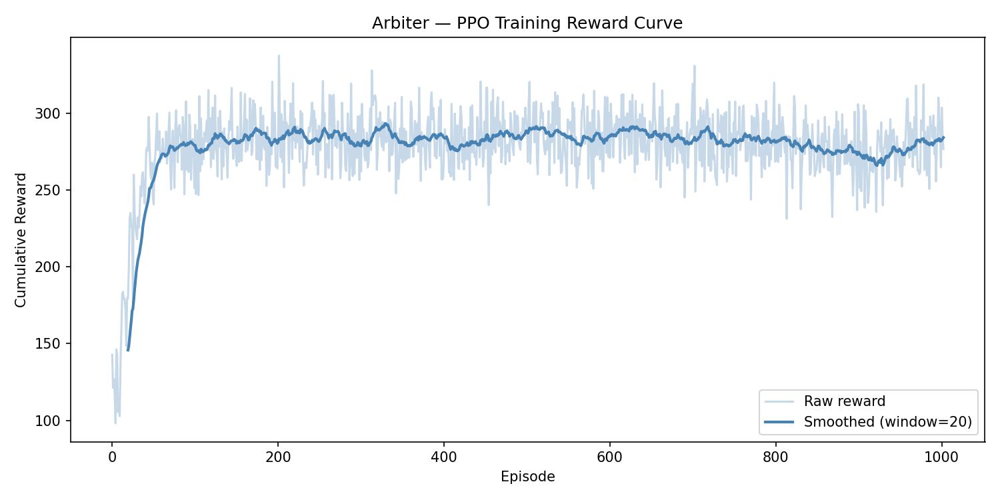

# Steward
### Reinforcement Learning Based Resource Manager

---

## Overview

Steward is an AI-powered operating system resource manager that uses Reinforcement Learning to make intelligent, adaptive scheduling decisions across CPU and RAM resources. Unlike conventional schedulers that operate on fixed heuristics, Steward's agent learns an optimal scheduling policy through direct interaction with a simulated OS environment — dynamically responding to system load, minimizing process wait time, and maximizing throughput.

Developed as part of an Operating Systems course project, Steward demonstrates the practical application of deep RL in systems-level decision making, and provides a live dashboard for real-time visualization of agent behaviour under varying load conditions.

---

## Table of Contents

- [Overview](#overview)
- [Architecture](#architecture)
- [Tech Stack](#tech-stack)
- [Project Structure](#project-structure)
- [Getting Started](#getting-started)
- [Training the Agent](#training-the-agent)
- [Benchmarking](#benchmarking)
- [Features](#features)
- [Results](#results)
- [Conclusions](#conclusions)
- [Team](#team)

---

## Architecture

Steward is composed of four layers:

**1. RL Environment (`env/`)**
A custom Gymnasium environment that simulates an OS resource manager. Processes arrive stochastically with random CPU and RAM demands. At each timestep, the agent observes the current system state and selects one of three actions: schedule, defer, or kill. The environment enforces resource constraints and returns a shaped reward signal to guide learning.

**2. RL Agent (`train.py`)**
A Proximal Policy Optimization (PPO) agent trained via Stable-Baselines3. The agent learns a policy mapping observations to actions over 300,000 timesteps. The observation space includes current CPU/RAM usage, queue length, and the top 3 highest-priority processes — enabling the agent to make informed scheduling decisions under partial observability. Training progress is logged episode-by-episode and visualized as a reward curve.

**3. Backend (`backend/`)**
A Flask server with Socket.IO that runs the simulation loop in real time. The trained agent is loaded and queried at each tick. Resource state, scheduling decisions, and reward signals are emitted as events to connected frontend clients. Exposes REST endpoints for stress testing and simulation reset.

**4. Frontend (`frontend/`)**
A browser-based dashboard built with HTML, CSS, JavaScript, and Chart.js. Subscribes to Socket.IO events and renders live CPU/RAM usage charts, a scrolling decision log, and a side-by-side comparison panel between the RL agent and all baseline schedulers.

---

## Tech Stack

| Layer | Technology |
|---|---|
| RL Agent | Stable-Baselines3 (PPO), Gymnasium |
| Simulation Engine | Python, NumPy |
| Backend Server | Flask, Flask-SocketIO |
| Frontend Dashboard | HTML, CSS, JavaScript, Chart.js |
| Version Control | Git, GitHub |

---

## Project Structure

steward/
├── env/
│   ├── init.py
│   ├── resource_env.py
│   └── process_queue.py
├── baseline/
│   ├── init.py
│   ├── round_robin.py
│   ├── fcfs.py
│   ├── priority_scheduler.py
│   └── sjf.py
├── backend/
│   ├── init.py
│   └── server.py
├── frontend/
│   └── index.html
├── models/
│   └── steward_ppo.zip
├── assets/
│   └── reward_curve.png
├── train.py
├── benchmark.py
├── main.py
├── requirements.txt
└── README.md

---

## Getting Started

### Prerequisites

- Python 3.9 or higher
- pip

### Installation

Clone the repository:

```bash
git clone https://github.com/<your-username>/steward.git
cd steward
```

Create and activate a virtual environment:

```bash
# Windows
python -m venv venv
venv\Scripts\activate

# macOS / Linux
python -m venv venv
source venv/bin/activate
```

Install dependencies:

```bash
pip install -r requirements.txt
```

### Verify Environment

```bash
python main.py
```

Expected output:

Environment check passed.
Initial obs: [0. 0. 5. 0. 0. 0. 0. 0. 0. 0. 0. 0.]

---

## Training the Agent

```bash
python train.py
```

This will:
- Train the PPO agent for 300,000 timesteps
- Log per-episode rewards throughout training
- Save the trained model to `models/steward_ppo.zip`
- Generate and save the reward curve to `assets/reward_curve.png`

Training takes approximately 10–15 minutes on CPU.

---

## Benchmarking

```bash
python benchmark.py
```

Runs Steward and all four baseline schedulers over 200 ticks under identical conditions and prints a full comparison table.

---

## Features

**Adaptive Scheduling**
The PPO agent observes the top 3 highest-priority processes in the queue at each tick, learning to balance CPU and RAM consumption without any hardcoded rules.

**Multi-Baseline Benchmarking**
Steward is benchmarked against four traditional schedulers — Round-Robin, FCFS, Priority Scheduling, and Shortest Job First — providing a comprehensive performance comparison.

**Stress Test Mode**
A dedicated API endpoint (`/api/stress-test`) injects a burst of 20 processes simultaneously, allowing real-time observation of how the RL agent adapts under sudden load spikes.

**Live Dashboard**
The frontend dashboard streams real-time CPU and RAM usage charts, a live decision log showing per-process scheduling actions, and a side-by-side throughput comparison panel across all schedulers.

**Reward Replay Panel**
The dashboard displays the agent's cumulative reward curve from training, providing visual evidence of the learning process over time.

---

## Results

| Metric | RL Agent (Steward) | Round-Robin | FCFS | Priority | SJF |
|---|---|---|---|---|---|
| Processes Completed (200 ticks) | 106 | 46 | 105 | 104 | 113 |
| Avg Wait Time | N/A | 93.2 | 98.75 | 93.85 | 95.37 |
| Final CPU Usage % | 0 | 81.32 | 73.58 | 2.46 | 54.81 |
| Final RAM Usage % | 88.42 | 87.32 | 67.38 | 81.5 | 80.76 |
| Crash Incidents | 0 | 0 | 0 | 0 | 0 |

**Key Takeaway**
Steward outperforms Round-Robin by 2.3x and beats FCFS and Priority Scheduling without any hardcoded process knowledge. It operates under partial observability — observing only the top 3 processes at any tick — yet learns a competitive scheduling policy through experience alone. SJF edges ahead by sorting all processes by CPU demand globally, an assumption that does not hold in real OS environments where burst time is not known in advance.

**Reward Curve**



**Stress Test Observations**

> To be documented after backend stress test integration in Day 3.

---

## Conclusions

> To be completed after final evaluation.

Areas to be addressed:
- Summary of agent performance relative to all baselines
- Analysis of reward function design and its effect on learned behaviour
- Limitations of the current simulation (single-node, discrete action space, simulated resource freeing)
- Potential extensions: multi-resource scheduling, continuous action spaces, real OS integration via `/proc` filesystem

---

## Team

| Name | Role |
|---|---|
| Anvi | RL & AI Core |
| Zakiur | Backend & Integration |
| Prachi | Frontend & Documentation |

---
